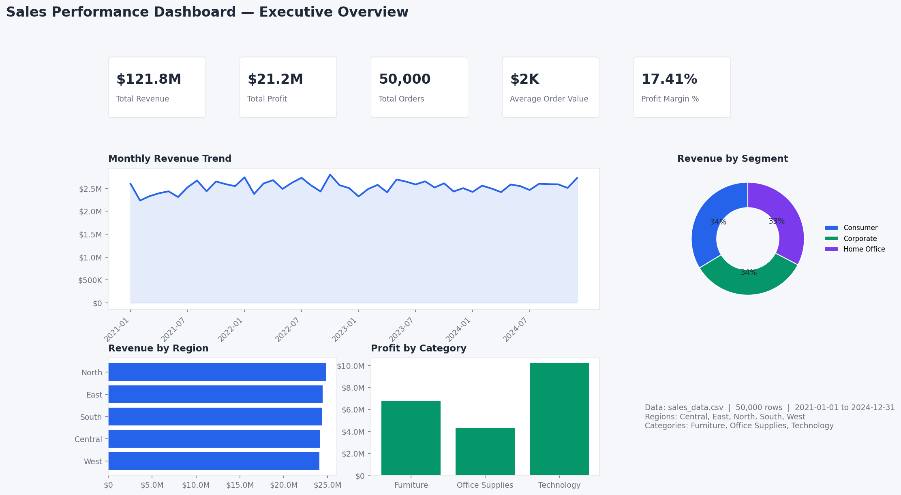
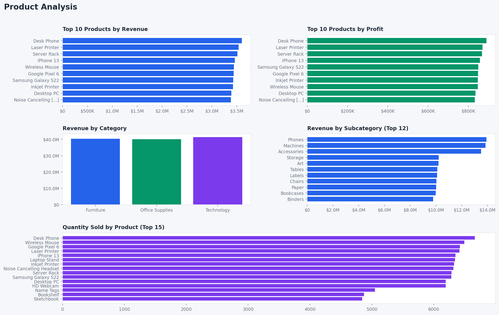
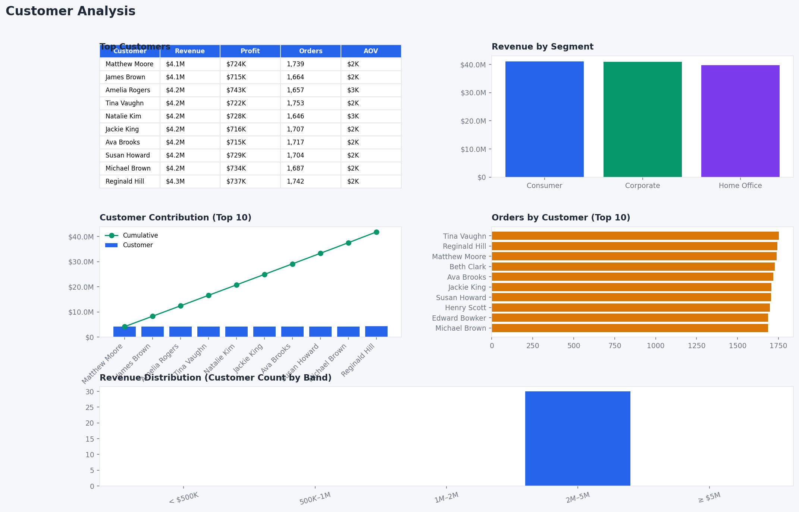

# Sales Performance Analytics

Sales Performance Dashboard using Power BI, SQL, and Python

**Period:** 2021–2024 · **Volume:** 50,000 orders · **Revenue:** $121.8M · **Profit margin:** 17.4%

## Dashboard

| Executive Overview | Product Analysis | Customer Analysis |
|---|---|---|
|  |  |  |

**Open dashboard:**

```powershell
# Power BI (requires Desktop installed)
.\open_dashboard.ps1

# OR interactive Python dashboard (works immediately)
pip install streamlit plotly
streamlit run dashboard/app.py
```

Power BI file: `powerbi/SalesPerformance.pbip`

## Key findings

- **East** leads on revenue and average order value; **Central** trails on margin and revenue per order.
- **Technology** drives the highest absolute profit; discount pressure is highest in Office Supplies.
- Top customers account for **>45%** of revenue — meaningful concentration risk across 30 accounts.
- Demand peaks in **Q4** with a secondary lift in **June**.

Full analysis: [Executive_Summary.md](Executive_Summary.md)

## Tech stack

| Layer | Tools |
|-------|-------|
| Data | Python, pandas |
| Analysis | SQL |
| Visualization | Power BI, matplotlib |
| Model | Star schema (fact + 4 dimensions) |

## Project structure

```
├── data/
│   ├── sales_data.csv          Source transactions
│   └── model/                    Star-schema tables for Power BI
├── powerbi/
│   ├── SalesPerformance.pbip     Power BI project
│   └── SalesPerformance/         Semantic model + 3 report pages
├── sql/                          Ad-hoc analysis queries
├── python/                       Pipelines and chart export
├── images/                       Dashboard exports
└── Executive_Summary.md          Stakeholder insights
```

## Setup

```bash
pip install -r requirements.txt
```

| Task | Command |
|------|---------|
| Clean & validate data | `python python/data_cleaning.py` |
| Exploratory analysis | `python python/eda.py` |
| KPI export | `python python/generate_kpis.py` |
| Refresh dashboard images | `python python/generate_dashboard_charts.py` |
| Rebuild Power BI model | `python python/build.py` |
| Interactive dashboard | `streamlit run dashboard/app.py` |
| Open Power BI project | `.\open_dashboard.ps1` |

## SQL analysis

| Script | Focus |
|--------|-------|
| `01_revenue_analysis.sql` | Revenue by region, state, and month |
| `02_customer_analysis.sql` | Segment and customer performance |
| `03_product_analysis.sql` | Category and product rankings |
| `04_profit_analysis.sql` | Margin and discount impact |
| `05_kpi_queries.sql` | Executive KPI definitions |

## Power BI report

Three pages, 22 visuals, star-schema model with DAX measures for revenue, profit, orders, and margin.

- **Executive Overview** — KPIs, monthly trend, region/category/segment breakdown, slicers
- **Product Analysis** — Top products, category mix, quantity sold
- **Customer Analysis** — Top accounts, segment revenue, contribution, concentration bands
